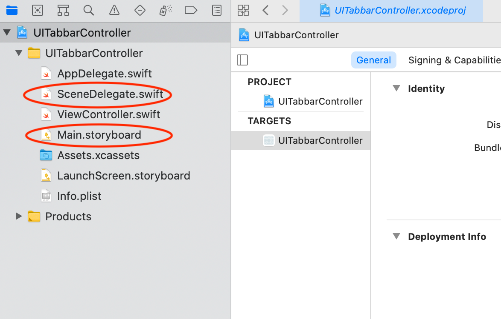

# programmatic-code-setup 
 The following provides quick instructions on removing storyboard related components and preparing your project for programmatic controls.

#### Delete the following from Info.plist file
* Application Scene Manifest
* Main storyboard file base name


#### Delete the SceneDelegate.swift and Main.storyboard files


#### Add the following code to AppDelegate.swift file
* create a window var within the AppDelegate class
* create the window within the ```didFinishLaunchingWithOptions``` function.
```swift
class AppDelegate: UIResponder, UIApplicationDelegate {

    var window: UIWindow?

    func application(_ application: UIApplication, didFinishLaunchingWithOptions launchOptions: [UIApplication.LaunchOptionsKey: Any]?) -> Bool {
        // Override point for customization after application launch.
        
        window = UIWindow(frame: UIScreen.main.bounds)
        window?.makeKeyAndVisible()
        window?.backgroundColor = .systemBackground
        window?.rootViewController = ViewController()
        return true
    }
    .
    .
    .
```

*** Note, the ```configurationForConnecting``` and ```didDiscardSceneSessions``` functions in the AppDelegate.swift file can be deleted.
