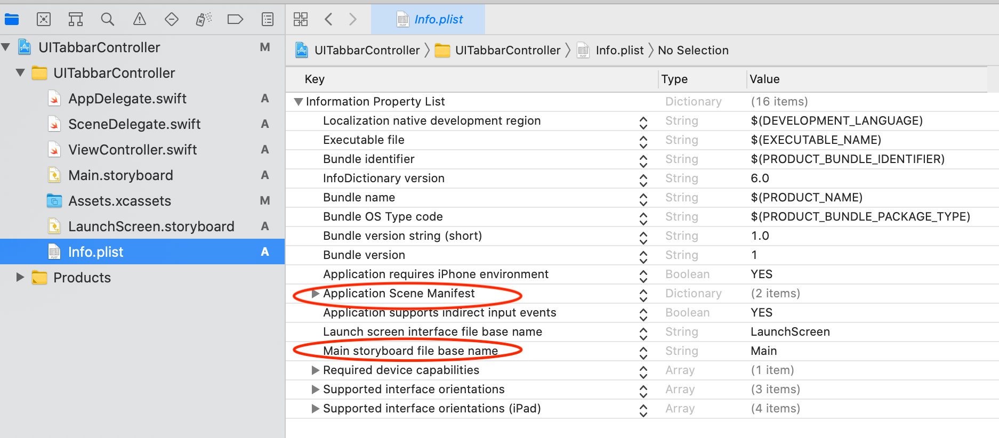

# programmatic-code-setup 

### Delete the following from Info.plist file
* Main storyboard file base name
* Application Scene Manifest

### Delete SceneDelegate.swift file

### Add the following code to AppDelegate.swift file
```

```
